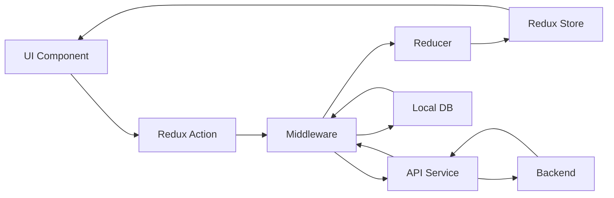

# アーキテクチャ設計書

## 1. 概要

### 1.1 ドキュメント情報

- **プロダクト名**: UnifiedCal
- **バージョン**: 1.0.0
- **作成日**: 2026-03-04
- **技術スタック**: React Native + TypeScript

### 1.2 目的

本ドキュメントは、UnifiedCalのシステムアーキテクチャ、技術スタック、データフロー、インフラストラクチャを定義し、開発チームが一貫した設計思想に基づいて実装を進めるためのガイドラインを提供する。

### 1.3 アーキテクチャ原則

- **クロスプラットフォーム優先**: iOS/Android で共通のコードベースを最大化
- **オフラインファースト**: ローカルデータを優先し、同期は非同期で実行
- **モジュラー設計**: 機能単位でのモジュール分割による保守性向上
- **パフォーマンス重視**: ネイティブに近いUX体験の提供
- **セキュアバイデザイン**: データ保護とプライバシーを設計段階から考慮

---

## 2. システム全体構成

### 2.1 ハイレベルアーキテクチャ

```
┌─────────────────────────────────────────────────────────────┐
│                        Client Layer                          │
├──────────────────────┬────────────────────┬─────────────────┤
│   iOS Application    │ Android Application│   Web (Future) │
│   (React Native)     │  (React Native)    │                 │
└──────────────────────┴────────────────────┴─────────────────┘
                               │
                               │ HTTPS/WebSocket
                               │
┌─────────────────────────────────────────────────────────────┐
│                         API Gateway                          │
│                    (Firebase/Supabase)                       │
└─────────────────────────────────────────────────────────────┘
                               │
                ┌──────────────┼──────────────┐
                │              │              │
┌───────────────▼───┐ ┌───────▼──────┐ ┌────▼───────────────┐
│  Authentication   │ │   Database   │ │   File Storage     │
│    Service        │ │   Service    │ │    Service         │
│ (Firebase Auth)   │ │  (Firestore) │ │ (Cloud Storage)    │
└───────────────────┘ └──────────────┘ └────────────────────┘
                               │
                               │
┌─────────────────────────────────────────────────────────────┐
│                    Push Notification Service                 │
│                         (FCM/APNs)                          │
└─────────────────────────────────────────────────────────────┘
```

### 2.2 技術スタック詳細

#### フロントエンド（モバイルアプリ）

```javascript
{
  "core": {
    "framework": "React Native 0.73+",
    "language": "TypeScript 5.9+",
    "bundler": "Metro",
    "developmentTool": "Expo SDK 50+"
  },
  "ui": {
    "components": "React Native Elements",
    "calendar": "react-native-calendars",
    "animations": "react-native-reanimated 3",
    "gestures": "react-native-gesture-handler"
  },
  "stateManagement": {
    "global": "Redux Toolkit",
    "local": "React Hooks",
    "persistence": "Redux Persist"
  },
  "dataLayer": {
    "localDB": "WatermelonDB / SQLite",
    "cache": "@react-native-async-storage",
    "api": "Axios + React Query"
  },
  "utilities": {
    "navigation": "React Navigation 6",
    "forms": "React Hook Form",
    "dates": "date-fns",
    "i18n": "react-native-localize"
  }
}
```

#### バックエンド（BaaS）

```javascript
{
  "platform": "Firebase / Supabase",
  "services": {
    "auth": "Firebase Authentication / Supabase Auth",
    "database": "Cloud Firestore / PostgreSQL",
    "storage": "Cloud Storage / Supabase Storage",
    "functions": "Cloud Functions / Edge Functions",
    "notifications": "Firebase Cloud Messaging"
  }
}
```

---

## 3. アプリケーションアーキテクチャ

### 3.1 レイヤーアーキテクチャ

```
┌─────────────────────────────────────────┐
│          Presentation Layer             │
│  (Screens, Components, Navigation)      │
├─────────────────────────────────────────┤
│           Business Logic Layer          │
│    (Redux Actions, Reducers, Sagas)     │
├─────────────────────────────────────────┤
│            Service Layer                │
│  (API, Auth, Notification, Storage)     │
├─────────────────────────────────────────┤
│           Data Access Layer             │
│    (Repository, Local DB, Cache)        │
└─────────────────────────────────────────┘
```

### 3.2 ディレクトリ構造

```
UnifiedCal/
├── src/
│   ├── screens/              # 画面コンポーネント
│   │   ├── Calendar/
│   │   ├── TaskDetail/
│   │   └── Statistics/
│   ├── components/            # 共通UIコンポーネント
│   │   ├── common/
│   │   ├── calendar/
│   │   └── task/
│   ├── navigation/            # ナビゲーション設定
│   ├── store/                 # Redux Store
│   │   ├── slices/
│   │   ├── middleware/
│   │   └── selectors/
│   ├── services/              # 外部サービスとの通信
│   │   ├── api/
│   │   ├── auth/
│   │   └── notification/
│   ├── repositories/          # データアクセス層
│   ├── models/                # データモデル定義
│   ├── utils/                 # ユーティリティ関数
│   ├── hooks/                 # カスタムフック
│   ├── constants/             # 定数定義
│   └── types/                 # TypeScript型定義
├── assets/                    # 画像、フォントなど
├── __tests__/                 # テストファイル
└── android/ & ios/            # プラットフォーム固有コード
```

### 3.3 状態管理アーキテクチャ

```typescript
// Redux Store Structure
interface AppState {
  auth: AuthState;
  calendar: CalendarState;
  tasks: TasksState;
  reminders: RemindersState;
  sync: SyncState;
  ui: UIState;
}

// Example: Task State Management
interface TasksState {
  entities: Record<string, Task>;
  ids: string[];
  selectedId: string | null;
  filter: TaskFilter;
  loading: boolean;
  error: Error | null;
}

// Redux Toolkit Slice
const tasksSlice = createSlice({
  name: 'tasks',
  initialState,
  reducers: {
    addTask: (state, action) => {
      /* ... */
    },
    updateTask: (state, action) => {
      /* ... */
    },
    deleteTask: (state, action) => {
      /* ... */
    },
    completeTask: (state, action) => {
      /* ... */
    },
  },
  extraReducers: (builder) => {
    // Handle async actions
  },
});
```

---

## 4. データアーキテクチャ

### 4.1 データフロー



### 4.2 データ同期戦略

#### オフラインファースト設計

```typescript
class SyncManager {
  // 1. ローカル変更を即座に反映
  async updateTaskLocally(task: Task) {
    await localDB.save(task);
    dispatch(updateTaskSuccess(task));
  }

  // 2. バックグラウンドで同期
  async syncWithServer() {
    const pendingChanges = await localDB.getPendingChanges();

    for (const change of pendingChanges) {
      try {
        await api.sync(change);
        await localDB.markAsSynced(change.id);
      } catch (error) {
        await this.handleSyncError(error, change);
      }
    }
  }

  // 3. コンフリクト解決
  resolveConflict(local: Task, remote: Task): Task {
    // Last-write-wins strategy with user notification
    if (remote.updatedAt > local.updatedAt) {
      return remote;
    }
    return local;
  }
}
```

### 4.3 データモデル

```typescript
// Core Domain Models
interface Task {
  id: string;
  title: string;
  description?: string;
  date: string;
  time?: string;
  categoryId: string;
  priority: Priority;
  status: TaskStatus;
  reminders: Reminder[];
  repeatRule?: RepeatRule;
  sharedWith: string[];
  attachments: Attachment[];
  location?: Location;
  createdAt: string;
  updatedAt: string;
  syncStatus: SyncStatus;
}

interface Calendar {
  id: string;
  name: string;
  color: string;
  ownerId: string;
  sharedUsers: SharedUser[];
  settings: CalendarSettings;
  syncStatus: SyncStatus;
}

interface Reminder {
  id: string;
  taskId: string;
  type: 'time' | 'location';
  triggerTime?: string;
  triggerLocation?: Location;
  message?: string;
  isActive: boolean;
}

// Sync Management
interface SyncStatus {
  lastSyncAt: string;
  pendingChanges: boolean;
  version: number;
}
```

---

## 5. セキュリティアーキテクチャ

### 5.1 認証・認可

```typescript
// Authentication Flow
class AuthService {
  async login(credentials: Credentials): Promise<User> {
    // 1. Validate credentials
    const { token, refreshToken } = await api.authenticate(credentials);

    // 2. Store tokens securely
    await SecureStore.setItem('accessToken', token);
    await SecureStore.setItem('refreshToken', refreshToken);

    // 3. Get user profile
    const user = await api.getUserProfile(token);

    // 4. Initialize local session
    await this.initializeSession(user);

    return user;
  }

  async refreshToken(): Promise<string> {
    const refreshToken = await SecureStore.getItem('refreshToken');
    const { token } = await api.refreshToken(refreshToken);
    await SecureStore.setItem('accessToken', token);
    return token;
  }
}
```

### 5.2 データ暗号化

```typescript
// Local Data Encryption
class EncryptionService {
  private key: CryptoKey;

  async encrypt(data: string): Promise<string> {
    const encrypted = await crypto.encrypt(this.key, data);
    return base64.encode(encrypted);
  }

  async decrypt(encryptedData: string): Promise<string> {
    const decoded = base64.decode(encryptedData);
    return await crypto.decrypt(this.key, decoded);
  }
}

// Sensitive Data Storage
class SecureStorage {
  async saveTask(task: Task): Promise<void> {
    if (task.isPrivate) {
      task.title = await encryption.encrypt(task.title);
      task.description = await encryption.encrypt(task.description);
    }
    await database.save(task);
  }
}
```

### 5.3 セキュリティポリシー

| 項目               | 実装方法                               |
| ------------------ | -------------------------------------- |
| 認証               | Firebase Auth / Supabase Auth with MFA |
| 通信               | HTTPS/TLS 1.3, Certificate Pinning     |
| ローカルストレージ | iOS Keychain / Android Keystore        |
| データ暗号化       | AES-256-GCM                            |
| セッション管理     | JWT with refresh token rotation        |
| APIアクセス制御    | Rate limiting, API keys                |

---

## 6. パフォーマンスアーキテクチャ

### 6.1 最適化戦略

#### コード分割とLazy Loading

```typescript
// Screen-level code splitting
const CalendarScreen = lazy(() => import('./screens/Calendar'));
const StatisticsScreen = lazy(() => import('./screens/Statistics'));

// Component-level lazy loading
const HeavyComponent = lazy(() => import('./components/HeavyComponent'));
```

#### リスト最適化

```typescript
// Virtualized List for large datasets
import { FlashList } from '@shopify/flash-list';

const TaskList = ({ tasks }) => (
  <FlashList
    data={tasks}
    renderItem={renderTask}
    estimatedItemSize={80}
    keyExtractor={(item) => item.id}
    // Performance optimizations
    removeClippedSubviews={true}
    maxToRenderPerBatch={10}
    windowSize={10}
  />
);
```

#### メモ化とキャッシング

```typescript
// Component memoization
const TaskItem = memo(
  ({ task, onComplete }) => {
    // Component implementation
  },
  (prevProps, nextProps) => {
    return (
      prevProps.task.id === nextProps.task.id &&
      prevProps.task.status === nextProps.task.status
    );
  }
);

// Selector memoization
const selectCompletedTasks = createSelector([selectAllTasks], (tasks) =>
  tasks.filter((task) => task.status === 'completed')
);
```

### 6.2 パフォーマンス指標

| 指標              | 目標値    | 測定方法          |
| ----------------- | --------- | ----------------- |
| アプリ起動時間    | < 3秒     | Performance API   |
| 画面遷移          | < 500ms   | Navigation timing |
| リスト表示(100件) | < 1秒     | Custom metrics    |
| メモリ使用量      | < 300MB   | Memory profiler   |
| バッテリー消費    | < 7%/時間 | OS metrics        |

---

## 7. インフラストラクチャ

### 7.1 CI/CD パイプライン

```yaml
# GitHub Actions Workflow
name: CI/CD Pipeline

on:
  push:
    branches: [main, develop]
  pull_request:
    branches: [main]

jobs:
  test:
    runs-on: ubuntu-latest
    steps:
      - uses: actions/checkout@v2
      - name: Install dependencies
        run: npm ci
      - name: Run tests
        run: npm test
      - name: Run linter
        run: npm run lint

  build-ios:
    runs-on: macos-latest
    steps:
      - name: Build iOS
        run: npm run build:ios
      - name: Upload to TestFlight
        run: fastlane ios beta

  build-android:
    runs-on: ubuntu-latest
    steps:
      - name: Build Android
        run: npm run build:android
      - name: Upload to Play Console
        run: fastlane android beta
```

### 7.2 環境構成

| 環境        | 用途         | インフラ                      |
| ----------- | ------------ | ----------------------------- |
| Development | 開発・テスト | Local + Firebase Emulator     |
| Staging     | 受入テスト   | Firebase (Staging Project)    |
| Production  | 本番環境     | Firebase (Production Project) |

### 7.3 モニタリング

```typescript
// Error Tracking
import * as Sentry from '@sentry/react-native';

Sentry.init({
  dsn: Config.SENTRY_DSN,
  environment: Config.ENVIRONMENT,
  tracesSampleRate: 0.1,
});

// Analytics
import analytics from '@react-native-firebase/analytics';

class AnalyticsService {
  trackEvent(event: string, params?: object) {
    analytics().logEvent(event, params);
  }

  trackScreen(screenName: string) {
    analytics().logScreenView({
      screen_name: screenName,
      screen_class: screenName,
    });
  }
}

// Performance Monitoring
import perf from '@react-native-firebase/perf';

const trace = await perf().startTrace('task_creation');
// ... perform task creation
await trace.stop();
```

---

## 8. 拡張性とモジュール性

### 8.1 プラグインアーキテクチャ

```typescript
// Plugin System
interface Plugin {
  name: string;
  version: string;
  init(): void;
  hooks: {
    onTaskCreate?: (task: Task) => Task;
    onTaskComplete?: (task: Task) => void;
    onCalendarRender?: (events: Event[]) => Event[];
  };
}

class PluginManager {
  private plugins: Map<string, Plugin> = new Map();

  register(plugin: Plugin) {
    this.plugins.set(plugin.name, plugin);
    plugin.init();
  }

  executeHook<T>(hookName: string, data: T): T {
    let result = data;
    this.plugins.forEach((plugin) => {
      if (plugin.hooks[hookName]) {
        result = plugin.hooks[hookName](result);
      }
    });
    return result;
  }
}
```

### 8.2 フィーチャーフラグ

```typescript
// Feature Toggle System
class FeatureFlags {
  private flags: Map<string, boolean>;

  async initialize() {
    const remoteConfig = await fetchRemoteConfig();
    this.flags = new Map(remoteConfig.features);
  }

  isEnabled(feature: string): boolean {
    return this.flags.get(feature) ?? false;
  }
}

// Usage
if (featureFlags.isEnabled('AI_SUGGESTIONS')) {
  return <AITaskSuggestions />;
}
```

---

## 9. 災害復旧とバックアップ

### 9.1 バックアップ戦略

```typescript
class BackupService {
  async createBackup(): Promise<Backup> {
    const data = {
      tasks: await localDB.getAllTasks(),
      calendars: await localDB.getAllCalendars(),
      settings: await storage.getSettings(),
      timestamp: new Date().toISOString(),
    };

    const backup = await this.compress(data);
    await cloudStorage.upload(backup);

    return backup;
  }

  async restore(backupId: string): Promise<void> {
    const backup = await cloudStorage.download(backupId);
    const data = await this.decompress(backup);

    await localDB.clear();
    await localDB.restore(data);

    await this.syncWithServer();
  }
}
```

### 9.2 エラーリカバリー

```typescript
class ErrorRecovery {
  async handleCriticalError(error: Error) {
    // 1. Log error
    await logger.error(error);

    // 2. Try to recover local state
    try {
      await this.recoverLocalState();
    } catch (recoveryError) {
      // 3. Fall back to last known good state
      await this.restoreLastGoodState();
    }

    // 4. Notify user
    showErrorDialog({
      title: 'エラーが発生しました',
      message: 'データの復旧を試みています',
      action: () => this.retryOperation(),
    });
  }
}
```

---

## 10. 技術的負債の管理

### 10.1 リファクタリング計画

| 優先度 | 項目                 | 理由                    | 予定時期 |
| ------ | -------------------- | ----------------------- | -------- |
| 高     | 状態管理の最適化     | Redux boilerplateの削減 | v1.1     |
| 中     | コンポーネント分割   | 再利用性の向上          | v1.2     |
| 低     | テストカバレッジ向上 | 80%以上を目指す         | v1.3     |

### 10.2 技術アップデート戦略

- React Native: 四半期ごとにアップデート検討
- 依存ライブラリ: 月次でセキュリティアップデート確認
- Breaking changes: メジャーバージョンアップ時に対応

---

## 11. まとめ

UnifiedCalのアーキテクチャは、React Nativeを基盤としたクロスプラットフォーム対応、オフラインファースト設計、高いパフォーマンスとセキュリティを実現する設計となっています。

### 主要な設計判断

1. **React Native採用**: iOS/Android両対応で開発効率を最大化
2. **Redux Toolkit**: 予測可能な状態管理とデバッグの容易さ
3. **Firebase/Supabase**: スケーラブルなBaaSによる開発速度向上
4. **オフラインファースト**: ユーザー体験の向上と信頼性確保
5. **モジュラー設計**: 機能追加と保守性の向上

この設計により、高品質なユーザー体験を提供しながら、開発効率と保守性を両立させることを目指します。
