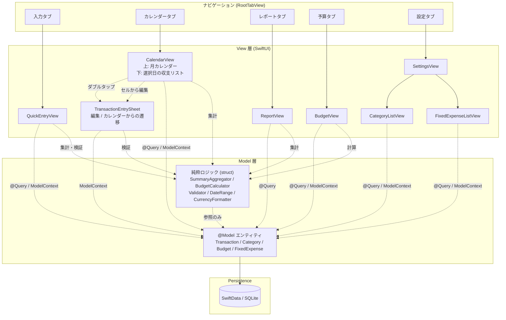
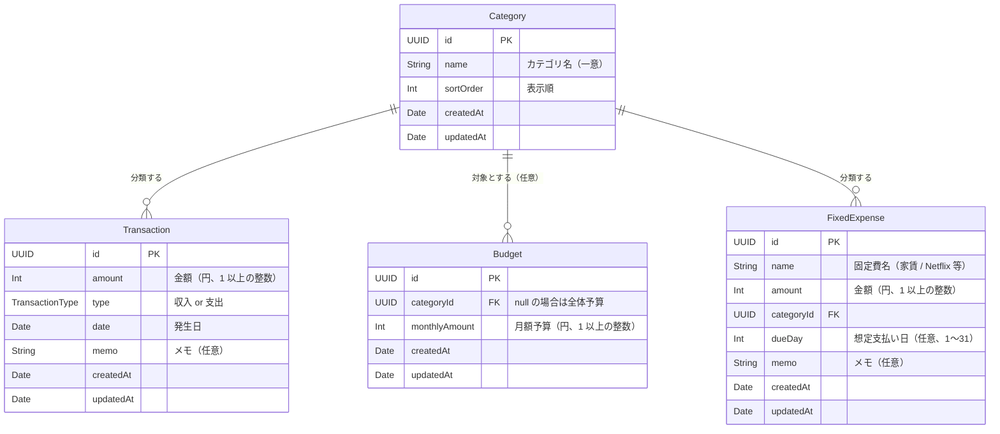

# 基本設計書

## テクノロジースタック

### 言語・ランタイム

| 技術    | バージョン                               | 選定理由                                                                                            |
| ------- | ---------------------------------------- | --------------------------------------------------------------------------------------------------- |
| Swift   | 5.9 以上（Xcode 同梱の最新安定版を使用） | iOS ネイティブ開発の標準言語。要件定義書の「Swift / SwiftUI 学習」目的と一致                        |
| iOS SDK | iOS 17 以上                              | SwiftData / Observation フレームワークなど、本設計で前提とするモダン API が利用可能になるバージョン |

### フレームワーク・ライブラリ

| 技術                           | バージョン     | 用途                         | 選定理由                                                                                                                                                                     |
| ------------------------------ | -------------- | ---------------------------- | ---------------------------------------------------------------------------------------------------------------------------------------------------------------------------- |
| SwiftUI                        | iOS 17+ 同梱版 | UI 構築                      | 宣言的 UI で iOS 標準アプリ風の見た目・挙動（Dynamic Type / ダークモード / SF Symbols）を低コストで実現可能。要件「iOS 標準カレンダー / リマインダー準拠」と最も親和性が高い |
| SwiftData                      | iOS 17+ 同梱版 | ローカル永続化               | SwiftUI と統合された宣言的データ層。学習対象として現行の Apple 推奨スタックに揃えられ、将来的な保守性も高い。要件「ローカル永続化」を満たすシンプルな選択肢                  |
| Observation（@Observable）     | iOS 17+ 同梱版 | 共有状態管理（必要時のみ）   | `ObservableObject` の後継。複数 View で共有する状態が必要な場合に限定使用                                                                                                    |
| Foundation                     | iOS 標準       | 日付・数値・通貨フォーマット | `Calendar` / `DateFormatter` / `NumberFormatter` をロケール対応の表示に利用                                                                                                  |
| Swift Testing（または XCTest） | Xcode 同梱版   | ユニットテスト               | Repository / ViewModel のテスト用。Swift Testing が利用可能な環境では優先採用                                                                                                |

サードパーティ依存は導入しない（ミニマリスト方針 / 学習目的 / 将来の App Store 公開時のリスク低減）。

### 開発ツール

| 技術                  | バージョン   | 用途                                                     |
| --------------------- | ------------ | -------------------------------------------------------- |
| Xcode                 | 最新安定版   | 開発 IDE / ビルド / シミュレータ実行 / 実機デプロイ      |
| Swift Package Manager | Xcode 同梱版 | 将来的な依存管理（現時点では使用なし）                   |
| Git                   | 任意         | バージョン管理                                           |
| SwiftLint（任意）     | 最新版       | コーディング規約自動チェック（development-guide で確定） |

## システムアーキテクチャ

### アーキテクチャパターン

**MV パターン（Apple 提唱の SwiftUI 標準アプローチ）** を採用する。

選定理由:

- Apple は SwiftUI で MVVM を推奨しておらず、`@Observable` / `@Query` / `@Environment(\.modelContext)` を活用した **View が直接 Model を観測する設計** を提唱している（WWDC 2023 以降）
- ViewModel 層を持たないことでコード量を最小化でき、ミニマリスト方針と整合する
- SwiftUI 本来のイディオム（`@Query` で SwiftData を直接取得、`@State` でローカル UI 状態を保持）を学習対象にできる
- 集計などの純粋ロジックは `struct` の純粋関数として切り出し、ユニットテスト可能性を維持する
- アプリ規模が小さく、ViewModel のレイヤーがもたらす抽象化メリットより、直接性のメリットが上回る



ルートは `TabView` による 5 タブ構成（入力 / カレンダー / レポート / 予算 / 設定）。設定タブのメニューは「カテゴリ管理」「固定費の設定」の 2 項目のみ（NavigationStack で各画面へプッシュ遷移）。収支入力は「入力タブ」から直接利用するほか、「カレンダーから日付をダブルタップ」「日別収支リストのセルから編集」の経路で `TransactionEntrySheet` を起動する。

固定費は完全手動入力方針に従い、Transaction を自動生成しない（`FixedExpense` は独立した参照リストとして保持される）。

### レイヤー/コンポーネント構成

#### View 層（SwiftUI）

- **責務**: 画面の宣言的構築、ユーザー入力の受け取り、SwiftData からのデータ取得 / 更新、純粋ロジックの呼び出し、結果のレンダリング
- **許可される操作**: `@Query` による SwiftData フェッチ、`@Environment(\.modelContext)` による insert / update / delete、`@State` / `@Bindable` による UI 状態管理、純粋ロジック struct の呼び出し
- **禁止される操作**: View 内に永続化や集計の **複雑なロジック** を直書きすること（純粋 struct に切り出すこと）

#### Model 層

##### @Model エンティティ

- **責務**: SwiftData によるデータ構造定義（`Transaction` / `Category` / `Budget` / `FixedExpense`）と永続化
- **許可される操作**: SwiftData の永続化 / `@Relationship` による関連
- **禁止される操作**: SwiftUI への依存

##### 純粋ロジック（struct）

- **責務**: View からも呼び出せる副作用のない計算・検証
  - `SummaryAggregator`: `[Transaction]` → `MonthlySummary`
  - `BudgetCalculator`: `[Transaction]` + `[Budget]` → `BudgetConsumption`
  - `Validator`: 入力値の検証ロジック
  - `DateRange` / `CurrencyFormatter`: 日付・通貨ユーティリティ
- **許可される操作**: 引数として受け取った値の参照と計算
- **禁止される操作**: SwiftData / SwiftUI / グローバル状態への依存

#### Persistence（SwiftData）

- **責務**: ディスク永続化（SQLite ベース）
- アプリ起動時に `ModelContainer` を構築し、`@Environment` で View に注入する

## データ設計

### データモデル



エンティティ概要:

- **Transaction（収支レコード）**: 1 件の収入または支出を表す。`Category` を参照する（多対 1）
- **Category（カテゴリ）**: 「食費」「交通費」など、Transaction の分類軸。初期データとして一般的なカテゴリを投入する
- **Budget（予算）**: 月単位の予算を表す。`categoryId` が設定されていればカテゴリ別予算、`null` であれば全体予算（同一スコープに対する予算は 1 件のみとする一意制約）
- **FixedExpense（固定費）**: 家賃・サブスクなどの定期支出をユーザーが手動管理するための参照リスト。**Transaction を自動生成しない**（要件定義書の「完全手動入力」コンセプトに従う）。レポート / 予算との自動連携も MVP では行わない
- `TransactionType` は `enum` で `income` / `expense` の 2 値を持つ
- カテゴリ削除時の挙動: 使用中のカテゴリは削除不可とする（Transaction / Budget / FixedExpense のいずれかから参照されている場合も削除不可）

### ストレージ方式

| データ種別             | ストレージ   | フォーマット                 | 理由                                                                                                 |
| ---------------------- | ------------ | ---------------------------- | ---------------------------------------------------------------------------------------------------- |
| Transaction / Category | SwiftData    | SQLite（SwiftData 内部実装） | 構造化データかつトランザクションが必要。SwiftData は SwiftUI と統合された宣言的 API でクエリも型安全 |
| ユーザー設定（あれば） | UserDefaults | Plist                        | 単純なキー値設定（例: 表示通貨記号、未使用の場合は省略）                                             |

### バックアップ戦略

アプリ独自のバックアップ実装は行わない。iOS 標準の自動バックアップ（iCloud バックアップ / Finder バックアップ）に SwiftData のデータは含まれるため、これを唯一のバックアップ経路とする。

要件「短期スコープ外（将来検討）」の `iCloud バックアップ連携` はアプリ独自実装ではなく、ユーザー側設定で完結する範囲を指す。

## インターフェース設計

### 外部インターフェース

該当なし（ネットワーク通信を行わない / 外部サービスと連携しない）。

### 内部インターフェース

MV パターンでは Repository protocol を持たず、View が `@Query` / `ModelContext` を経由して SwiftData を直接利用する。集計・検証は純粋 struct の関数として提供し、View から直接呼び出す。

```swift
// 純粋ロジックのシグネチャ（Swift 擬似コード）
enum SummaryAggregator {
    static func summarize(_ transactions: [Transaction]) -> MonthlySummary
}

enum BudgetCalculator {
    static func consumption(transactions: [Transaction], budgets: [Budget]) -> BudgetConsumption
}

enum Validator {
    static func validate(amount: String) -> Result<Int, ValidationError>
    static func validate(categoryName: String, existing: [Category]) -> Result<Void, ValidationError>
    // 他、固定費名・メモ・想定支払い日 等
}

// 集計結果の値型
struct MonthlySummary {
    let totalIncome: Int   // 円
    let totalExpense: Int  // 円
    let byCategory: [CategoryBreakdown]
}

struct BudgetConsumption {
    let overall: BudgetStatus?  // 全体予算がなければ nil
    let byCategory: [CategoryBudgetStatus]
}

struct BudgetStatus {
    let budgetAmount: Int     // 円
    let spentAmount: Int      // 円
    let remainingAmount: Int  // 円。負値は超過
    let consumptionRate: Double  // 0.0 〜（1.0 超で超過）
}
```

View 内での標準的な利用パターン:

```swift
// 例: CalendarView
@Query(filter: #Predicate<Transaction> { ... }, sort: \.date)
var monthTransactions: [Transaction]

@Environment(\.modelContext) private var modelContext

var body: some View {
    let summary = SummaryAggregator.summarize(monthTransactions)
    // ... summary を使った描画 ...
}
```

テスト方針: 純粋 struct（Aggregator / Calculator / Validator）はユニットテストの主対象。SwiftData 連携は in-memory `ModelContainer` を使った統合テストで担保する（モック差し替えは行わない）。

### 主要画面一覧

詳細な画面遷移・ワイヤーフレームは詳細設計書で定義する。基本設計レベルでは以下を識別する。ルートは 5 つのタブ + シート / プッシュ遷移で構成される。

| 画面 ID | 画面名           | 配置                 | 概要                                                                                                                                                 |
| ------- | ---------------- | -------------------- | ---------------------------------------------------------------------------------------------------------------------------------------------------- |
| S-01    | 入力画面         | タブ（入力）         | 起動時のデフォルト日付は「今日」。金額・種別・カテゴリ・メモを入力して保存                                                                           |
| S-02    | カレンダー画面   | タブ（カレンダー）   | 上半分: 月カレンダー（各日の支出サマリ表示）+ 月次サマリヘッダ。下半分: シングルタップで選択した日の収支リスト。日付セルのダブルタップで S-06 を起動 |
| S-03    | レポート画面     | タブ（レポート）     | 月次の合計収入・合計支出・差額、カテゴリ別の円グラフと内訳。月切替可能                                                                               |
| S-04    | 予算画面         | タブ（予算）         | 全体予算 / カテゴリ別予算の設定・編集・削除、当月の消化額・残額・消化率の表示、超過時の視覚アラート                                                  |
| S-05    | 設定画面         | タブ（設定）         | 「カテゴリ管理（S-07）」「固定費の設定（S-08）」の 2 メニューのみ。将来必要に応じてメニューを追加                                                    |
| S-06    | 収支入力シート   | モーダル（sheet）    | カレンダーからのダブルタップ起動時、および既存レコード編集時に表示。完了で元画面に復帰                                                               |
| S-07    | カテゴリ管理画面 | プッシュ（設定から） | カテゴリの追加・編集・削除。S-05 から `NavigationStack` で遷移                                                                                       |
| S-08    | 固定費の設定画面 | プッシュ（設定から） | 固定費（家賃 / サブスク等）の追加・編集・削除。一覧表示。Transaction の自動生成は行わない                                                            |

## セキュリティ設計

### データ保護

- **暗号化**: iOS のファイル保護機能（Data Protection API）に準拠。SwiftData が作成するストアファイルにデフォルトで適用される `NSFileProtectionCompleteUntilFirstUserAuthentication` を維持し、追加設定は行わない
- **アクセス制御**: 端末ロック解除がアプリ起動の前提。アプリ内追加認証（Face ID / パスコード）は MVP では実装しない（必要なら Post-MVP）
- **機密情報管理**: 本アプリは API キー / シークレットを保持しない。Keychain の利用も不要

### 入力検証

- **金額**: 1 以上の整数（円単位、JPY 専用前提）。負数・小数・0 は不可
- **カテゴリ名**: 空文字不可。最大 30 文字。重複不可（同名カテゴリの登録を禁止）
- **日付**: 未来日も入力可（予定支出など）。極端に古い日付は妥当性チェックの対象外（個人責任）
- **メモ**: 任意。最大 200 文字（過度に長い入力で UI が崩れないようにするための上限）
- **固定費名**: 空文字不可。最大 30 文字。重複は許容（同じサービスを複数登録するケースを想定）
- **想定支払い日**: 1〜31 の整数。31 日設定で月末日数が 30 以下の月は月末扱い（表示時のみ調整）
- **削除操作**: カテゴリ削除前に当該カテゴリを使用する Transaction / Budget / FixedExpense のいずれもが 0 件であることを Repository で確認し、違反する場合は例外

### 監査・ログ

- 個人ユース完結のため、利用ログ / 分析 SDK は導入しない
- デバッグ時のみ `os.Logger` を用いて開発者向けログを出力（リリースビルドでは無効）

## パフォーマンス設計

要件定義書のパフォーマンス要件を以下の手段で達成する。

- **起動から当月カレンダー表示完了 2 秒以内**:
  - 起動時に当月分の Transaction のみを `#Predicate` で範囲フィルタ取得
  - SwiftData の `@Query` を View に直接バインドし、ViewModel 経由のロード完了を待たずに UI を表示
  - カテゴリ一覧は件数が少ないため起動時にメモリにキャッシュ
- **カレンダーの月切り替え 0.5 秒以内**:
  - 月切替時は次月分のみ追加取得（前月分は破棄せずキャッシュし、再表示時の再クエリを回避）
  - `Transaction.date` に対する SwiftData のインデックスを利用（`@Attribute(.unique)` ではなく通常属性、内部的に SQLite インデックスが効く範囲）
  - 月次サマリは Transaction 取得結果から計算する（追加クエリを発行しない）

## 技術的制約

### 環境要件

- **OS（実行）**: iOS 17 以上（SwiftData / Observation 利用のため）
- **OS（開発）**: macOS（最新の Xcode が動作するバージョン）
- **デバイス**: iPhone（メイン）。iPad は対応外（動作禁止はしないが、レイアウト最適化は行わない）
- **必要な外部依存**: なし

### その他の制約

- サードパーティライブラリは原則導入しない（学習・保守・公開時のリスク回避）
- ネットワーク権限を Info.plist で要求しない
- バックグラウンド処理は使用しない
