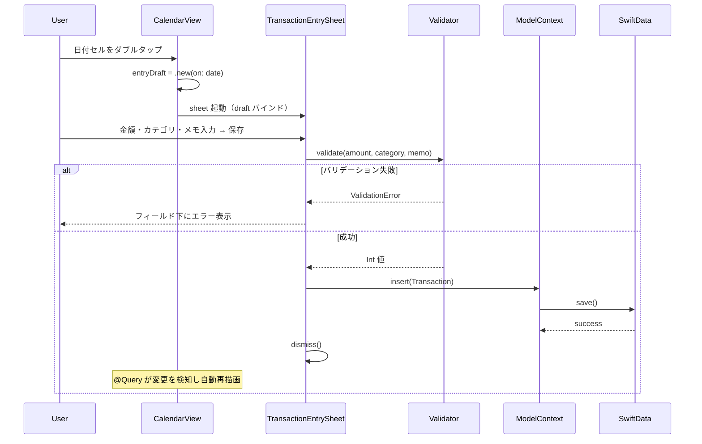
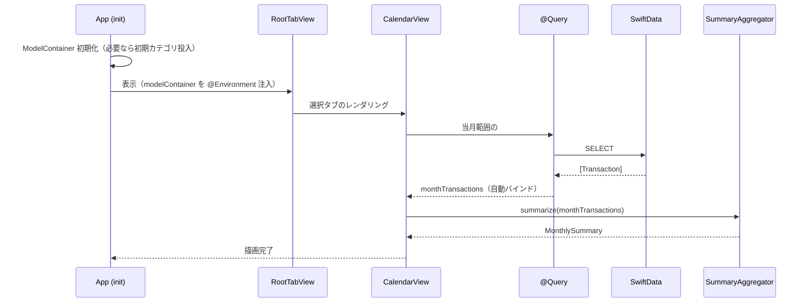
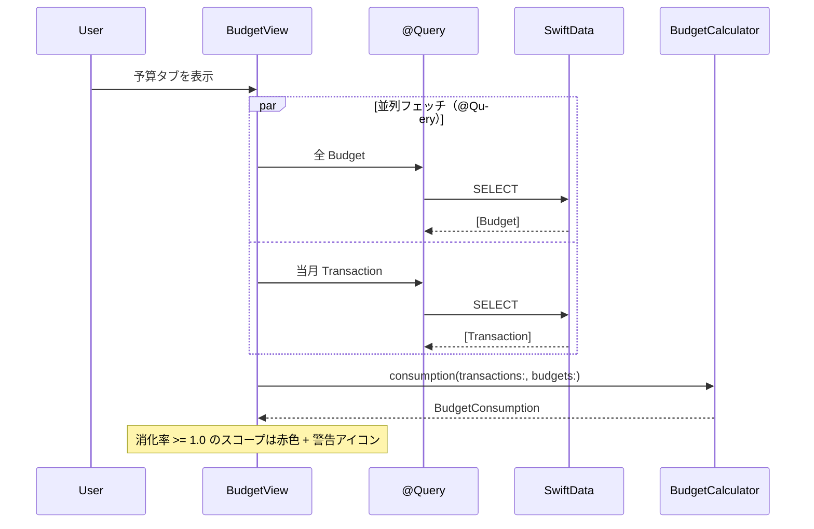
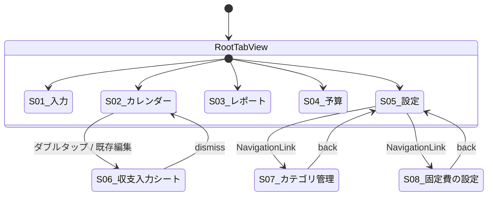

# 詳細設計書

基本設計書で定義した MV パターン構成を、Swift / SwiftUI / SwiftData の実装レベルに落とし込む。

## データモデル定義

### エンティティ: Transaction

```swift
@Model
final class Transaction {
    @Attribute(.unique) var id: UUID
    var amount: Int                  // 円、1 以上の整数
    var type: TransactionType        // .income / .expense
    var date: Date                   // 発生日（時刻は 00:00 に正規化）
    var memo: String                 // メモ。未入力時は空文字
    var category: Category?          // 多対 1
    var createdAt: Date
    var updatedAt: Date

    init(amount: Int, type: TransactionType, date: Date, memo: String = "", category: Category) { ... }
}

enum TransactionType: String, Codable, CaseIterable {
    case income, expense
}
```

**制約**:

- `amount` は 1 以上の整数（バリデーション層で担保）
- `date` は時刻成分を 00:00 に揃える（日単位集計・月単位集計を簡潔にするため）
- `memo` は最大 200 文字
- `category` は必須（nil 不可。ただし @Model 上は nullable で定義し、Repository / ViewModel で必須化）

### エンティティ: Category

```swift
@Model
final class Category {
    @Attribute(.unique) var id: UUID
    @Attribute(.unique) var name: String   // 1〜30 文字、重複不可
    var sortOrder: Int                     // 表示順（小さい順）
    @Relationship(deleteRule: .deny, inverse: \Transaction.category)
    var transactions: [Transaction] = []
    @Relationship(deleteRule: .deny, inverse: \Budget.category)
    var budgets: [Budget] = []
    @Relationship(deleteRule: .deny, inverse: \FixedExpense.category)
    var fixedExpenses: [FixedExpense] = []
    var createdAt: Date
    var updatedAt: Date
}
```

**制約**:

- `name` は一意・1〜30 文字
- `deleteRule: .deny` により参照中のカテゴリは SwiftData レベルでも削除拒否

### エンティティ: Budget

```swift
@Model
final class Budget {
    @Attribute(.unique) var id: UUID
    var category: Category?      // nil の場合は全体予算
    var monthlyAmount: Int       // 月額予算（円、1 以上の整数）
    var createdAt: Date
    var updatedAt: Date
}
```

**制約**:

- `monthlyAmount` は 1 以上
- 全体予算（`category == nil`）は最大 1 件
- 同一カテゴリに対する予算は最大 1 件（Repository の `upsert` で担保）

### エンティティ: FixedExpense

```swift
@Model
final class FixedExpense {
    @Attribute(.unique) var id: UUID
    var name: String             // 1〜30 文字
    var amount: Int              // 円、1 以上の整数
    var category: Category?      // 必須（運用上）
    var dueDay: Int?             // 想定支払い日（1〜31、任意）
    var memo: String             // 最大 200 文字
    var createdAt: Date
    var updatedAt: Date
}
```

**制約**:

- `name` 1〜30 文字、重複は許容
- `dueDay` は 1〜31 の整数または nil。31 で月末日数が不足する月は表示時に月末扱い

### ER 図（基本設計書の再掲・補足）

```mermaid
erDiagram
    Category ||--o{ Transaction   : "分類"
    Category ||--o{ Budget        : "対象（任意）"
    Category ||--o{ FixedExpense  : "分類"

    Transaction { UUID id PK; Int amount; String type; Date date; String memo; }
    Category    { UUID id PK; String name UK; Int sortOrder; }
    Budget      { UUID id PK; UUID categoryId FK; Int monthlyAmount; }
    FixedExpense{ UUID id PK; String name; Int amount; UUID categoryId FK; Int dueDay; }
```

### 初期データ

アプリ初回起動時、以下のカテゴリを `sortOrder` の昇順で投入する（ユーザーは後から編集可）。

`食費 / 日用品 / 交通費 / 住居 / 水道光熱 / 通信 / 医療 / 娯楽 / 衣服 / 給与 / その他`

## コンポーネント設計

### View 設計

各 View は `@Query` で SwiftData を直接取得し、`@Environment(\.modelContext)` 経由で書き込みを行う。フォーム系の入力中状態は `@State` でローカル保持し、保存時に `Validator` で検証して `modelContext.insert` / `try modelContext.save()` を呼ぶ。

| View | 取得（@Query） | 書き込み（ModelContext） | 純粋ロジック呼び出し |
| --- | --- | --- | --- |
| QuickEntryView | `Category`（Picker 用） | `Transaction.insert` | `Validator` |
| CalendarView | `Transaction`（当月、`#Predicate` で月範囲絞り込み）+ `Category` + `Budget` | （なし。編集はシート側） | `SummaryAggregator` / `DateRange` |
| ReportView | `Transaction`（選択月）+ `Category` | （なし） | `SummaryAggregator` |
| BudgetView | `Budget` + `Transaction`（当月） | `Budget.insert / update / delete` | `BudgetCalculator` |
| SettingsView | （なし。`NavigationLink` のみ） | （なし） | （なし） |
| TransactionEntrySheet | `Category`（Picker 用） | `Transaction.insert / update` | `Validator` |
| CategoryListView | `Category` | `Category.insert / update / delete` | `Validator` |
| FixedExpenseListView | `FixedExpense` + `Category` | `FixedExpense.insert / update / delete` | `Validator` |

#### View の代表的な実装パターン

```swift
// CalendarView の主要部分（疑似コード）
struct CalendarView: View {
    @State private var displayedMonth: Date = .now.startOfMonth()
    @State private var selectedDate: Date?
    @State private var entryDraft: EntryDraft?  // 非 nil で sheet 起動

    @Query private var monthTransactions: [Transaction]  // 動的フィルタは init で設定

    var body: some View {
        let summary = SummaryAggregator.summarize(monthTransactions)
        let dayTransactions = monthTransactions.filter { ... selectedDate ... }

        VStack {
            MonthSummaryHeader(summary: summary)
            CalendarGrid(transactions: monthTransactions, selectedDate: $selectedDate)
                .onTapGesture(count: 2) { entryDraft = .new(on: $0) }   // ダブルタップ
            DailyTransactionList(transactions: dayTransactions)
        }
        .sheet(item: $entryDraft) { TransactionEntrySheet(draft: $0) }
    }
}
```

### 純粋ロジック（struct）

すべて副作用なしの `enum` namespace（インスタンス化不要）。SwiftUI / SwiftData に依存しない純粋関数のみ。

| 種別 | 名前 | シグネチャ概要 |
| --- | --- | --- |
| 集計 | `SummaryAggregator` | `summarize([Transaction]) -> MonthlySummary` |
| 集計 | `BudgetCalculator` | `consumption(transactions:, budgets:) -> BudgetConsumption` |
| 検証 | `Validator` | `validate(amount: String) -> Result<Int, ValidationError>` 等 |
| 日付 | `DateRange` | `monthBounds(of: Date) -> (Date, Date)` / `dayBounds(of:)` |
| 表示 | `CurrencyFormatter` | `format(_ value: Int) -> String`（"¥1,234"、ロケール固定 `ja_JP`） |

これらは全てユニットテストの主対象となる。

### SwiftData 書き込みの規約

View から `modelContext` を直接利用する際、以下を共通規約とする:

- 書き込み（insert / update / delete）の直後に `try modelContext.save()` を必ず呼ぶ
- `update` 時は対象オブジェクトの `updatedAt = .now` を手動で更新する
- カテゴリ削除は `@Relationship(deleteRule: .deny)` + 事前カウント確認の二重防御
- 削除時の参照確認はヘルパー関数 `CategoryDeletionGuard.canDelete(_ category: Category) -> Bool` に切り出す（純粋ロジック）

## ユースケース詳細

### UC-01: カレンダー画面で日付をダブルタップ → 収支入力 → 保存



### UC-02: 起動 → 当月カレンダー表示



### UC-03: 予算超過の検知と表示



## 画面設計

### S-01 入力画面（QuickEntryView）

| 項目       | 説明        | フォーマット / 入力 UI                         |
| ---------- | ----------- | ---------------------------------------------- |
| 種別       | 収入 / 支出 | セグメンテッドコントロール（デフォルト: 支出） |
| 金額       | 取引金額    | 数値キーボード。空・0・非数値は不可            |
| 日付       | 発生日      | DatePicker（デフォルト: 今日）                 |
| カテゴリ   | 分類        | Picker（必須）                                 |
| メモ       | 任意の説明  | TextField（最大 200 文字）                     |
| 保存ボタン | 保存実行    | 全項目妥当時のみ有効化                         |

### S-02 カレンダー画面（CalendarView）

**上半分**: 月カレンダー + 月次サマリヘッダ。各日のセルに当日の支出合計（簡略表示、当日合計が 0 の場合は空欄）。

**下半分**: シングルタップで選択した日の `Transaction` リスト（金額・カテゴリ・メモを 1 行表示）。各行タップで編集シート起動。

| ジェスチャ     | 対象             | 挙動                                                |
| -------------- | ---------------- | --------------------------------------------------- |
| シングルタップ | 日付セル         | `selectedDate = 該当日`、下半分を更新               |
| ダブルタップ   | 日付セル         | 該当日を初期値とした `TransactionEntrySheet` を起動 |
| 横スワイプ     | カレンダー領域   | 月切替（前月 / 翌月）                               |
| タップ         | 下半分のリスト行 | 既存レコード編集シート起動                          |

### S-03 レポート画面（ReportView）

| 項目               | 説明                                             |
| ------------------ | ------------------------------------------------ |
| 月切替コントロール | ヘッダ。前月 / 翌月の矢印 + 月名表示             |
| 月次合計           | 合計収入 / 合計支出 / 差額（円フォーマット）     |
| カテゴリ別円グラフ | 支出のみを円グラフ表示。スライスは金額降順       |
| カテゴリ別内訳     | カテゴリ名・金額・割合の表                       |
| データなし表示     | 当該月に Transaction が 0 件の場合「データなし」 |

### S-04 予算画面（BudgetView）

| 項目           | 説明                                                 |
| -------------- | ---------------------------------------------------- |
| 全体予算       | 月額・消化額・残額・消化率（プログレスバー）         |
| カテゴリ別予算 | 各 Budget についてプログレスバー表示                 |
| 編集ボタン     | 各行から下書き編集シートを起動                       |
| 追加ボタン     | 新規 Budget 作成（全体 / カテゴリ選択）              |
| 超過時アラート | 該当行を赤色 + 警告アイコン表示（OS 通知は使わない） |

### S-05 設定画面 / S-07 カテゴリ管理 / S-08 固定費の設定

- **S-05**: `List` で 2 行（カテゴリ管理 / 固定費の設定）。タップで `NavigationStack` push
- **S-07**: カテゴリ一覧（並び替え対応）+ 追加 / 編集 / 削除（使用中は削除ボタン無効）
- **S-08**: 固定費一覧 + 追加 / 編集 / 削除。各行は名称 / 金額 / カテゴリ / 想定支払い日を表示

### S-06 収支入力シート

`QuickEntryView` と同等のフォームを sheet で表示。`init(draft: EntryDraft)` で日付・既存値を初期化し、保存後 dismiss。

### 画面遷移図



## アルゴリズム設計

### 月次サマリ算出（SummaryAggregator）

`[Transaction]` を 1 回走査（O(n)）で集計する純粋関数。

1. `type == .income` の `amount` 合計 → `totalIncome`
2. `type == .expense` の `amount` 合計 → `totalExpense`
3. `expense` のみ `category` でグルーピングし合計 → `byCategory`（金額降順）

### 予算消化率算出

当月の `[Transaction]` と `[Budget]` から `BudgetConsumption` を作る。

1. 当月の `expense` を `category` ごと、および全体で合計
2. `Budget` ごとに `BudgetStatus(budget, spent, remaining = budget - spent, rate = spent / budget)` を生成
3. `rate >= 1.0` で「超過」フラグ（View で赤色 + 警告アイコンに使用）
4. 全体 / カテゴリ別予算が未設定なら対応フィールドは nil または空配列

## エラーハンドリング

### Error 型階層

```swift
enum ValidationError: Error, LocalizedError {
    case amountInvalid          // 金額が不正（0以下・非整数）
    case categoryRequired
    case nameTooLong
    case nameEmpty
    case duplicateCategoryName(String)
    case memoTooLong
    case dueDayOutOfRange
}

enum DataIntegrityError: Error, LocalizedError {
    case categoryInUse           // 削除対象カテゴリが Transaction / Budget / FixedExpense から参照中
    case duplicateBudgetScope    // 同一スコープに既に Budget 存在
}

// SwiftData の永続化失敗は標準の `Error`（`try modelContext.save()` の throw）として扱う
```

`ValidationError` と `DataIntegrityError` は純粋ロジック（`Validator` / `CategoryDeletionGuard` / Budget upsert 関数）から発生し、書き込み前に View でハンドリングする。

### エラーの分類と処理

| エラー種別                            | 発生箇所                  | 処理                                         | ユーザー表示                                                  |
| ------------------------------------- | ------------------------- | -------------------------------------------- | ------------------------------------------------------------- |
| ValidationError                       | 入力フォーム保存時        | 該当フィールドにエラー表示、保存ボタン無効化 | フィールド下に短文（例: 「金額は 1 以上を入力してください」） |
| ValidationError.duplicateCategoryName | カテゴリ追加 / 名称変更時 | 保存中断                                     | フィールド下: 「同名のカテゴリが既に存在します」              |
| DataIntegrityError.categoryInUse      | カテゴリ削除時            | 削除中断                                     | アラート: 「このカテゴリは使用中のため削除できません」        |
| DataIntegrityError.duplicateBudgetScope | 予算追加時              | 保存中断                                     | アラート: 「この予算は既に設定されています」（編集に誘導）    |
| SwiftData 保存失敗（Error）           | `try modelContext.save()` | 内部ログ出力（`os.Logger`）、保存中断        | アラート: 「保存に失敗しました。もう一度お試しください」      |
| 想定外例外（その他 Error）            | 任意                      | 内部ログ出力、画面はエラーステートへ遷移     | 汎用アラート: 「予期しないエラーが発生しました」              |

**リトライ方針**: 永続化失敗は自動リトライしない。ローカル DB 操作のため一時的な失敗が起こりにくく、自動リトライがかえって挙動を不安定化する。ユーザーの再操作で対応する。

**外部システム例外**: なし（ネットワーク通信なし）。
