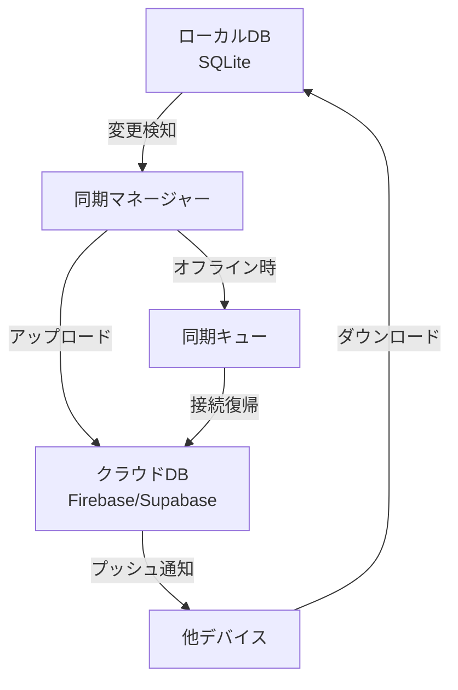
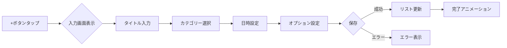
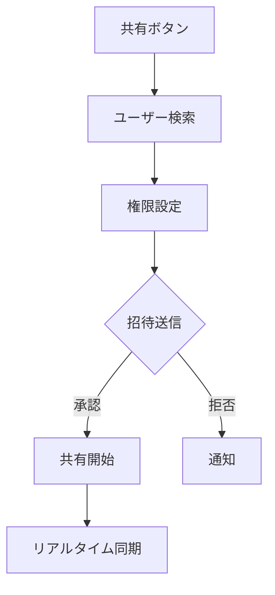

# 機能設計書

## 1. 概要

### ドキュメント情報

- **プロダクト名**: UnifiedCal
- **バージョン**: 1.0.0
- **作成日**: 2026-03-04
- **対象プラットフォーム**: iOS/Android（React Native）

### 目的

本ドキュメントは、UnifiedCalの機能要件を具体的な画面設計、インタラクション、データフローとして定義し、開発チームが実装可能なレベルまで詳細化することを目的とする。

---

## 2. 画面構成

### 2.1 画面一覧

| 画面ID | 画面名               | 説明                       | 優先度 |
| ------ | -------------------- | -------------------------- | ------ |
| S001   | スプラッシュ画面     | アプリ起動時の画面         | P0     |
| S002   | オンボーディング     | 初回起動時のチュートリアル | P0     |
| S003   | メイン画面（月表示） | カレンダー月表示がメイン   | P0     |
| S004   | 週表示画面           | 時間軸での週間表示         | P0     |
| S005   | 日表示画面           | 1日の詳細表示              | P0     |
| S006   | タスク追加/編集画面  | タスク情報の入力           | P0     |
| S007   | リマインダー設定画面 | 通知設定                   | P0     |
| S008   | 統計ダッシュボード   | 達成度と分析               | P1     |
| S009   | 設定画面             | アプリ設定                 | P0     |
| S010   | 共有設定画面         | カレンダー共有管理         | P1     |

### 2.2 画面遷移図

```
スプラッシュ画面(S001)
    ├── 初回起動 → オンボーディング(S002)
    │                    └── メイン画面(S003)
    └── 2回目以降 → メイン画面(S003)
                        ├── 左右スワイプ → 週表示(S004) ⟷ 日表示(S005)
                        ├── ＋ボタン → タスク追加(S006)
                        ├── タスクタップ → タスク編集(S006)
                        ├── 長押し → リマインダー設定(S007)
                        ├── 統計アイコン → ダッシュボード(S008)
                        ├── 設定アイコン → 設定画面(S009)
                        └── 共有アイコン → 共有設定(S010)
```

---

## 3. 画面詳細設計

### 3.1 メイン画面（月表示）- S003

#### レイアウト構成

```
┌─────────────────────────────────────┐
│ [≡] UnifiedCal        [📊] [⚙️] [👥] │ <- ヘッダー
├─────────────────────────────────────┤
│  ＜  2026年3月  ＞                  │ <- 月選択
├─────────────────────────────────────┤
│ 日 月 火 水 木 金 土                 │ <- 曜日ヘッダー
│ ┌──┬──┬──┬──┬──┬──┬──┐         │
│ │25│26│27│28│ 1│ 2│ 3│         │ <- カレンダーグリッド
│ │  │  │●2│  │●1│  │●3│         │    ●はタスク数
│ ├──┼──┼──┼──┼──┼──┼──┤         │
│ │ 4│ 5│ 6│ 7│ 8│ 9│10│         │
│ │●1│  │●2│●1│  │  │  │         │
│ └──┴──┴──┴──┴──┴──┴──┘         │
├─────────────────────────────────────┤
│ 今日のタスク (3/5完了) ━━━━━ 60%    │ <- 進捗バー
├─────────────────────────────────────┤
│ □ 会議資料の準備         10:00      │ <- タスクリスト
│ ✓ メール返信            完了        │
│ □ レポート作成          14:00      │
│ [＋] タスクを追加                   │
└─────────────────────────────────────┘
```

#### インタラクション

| 操作               | アクション   | 結果                         |
| ------------------ | ------------ | ---------------------------- |
| 日付タップ         | 選択         | その日のタスクをリストに表示 |
| 日付長押し         | クイック追加 | タスク追加ダイアログ表示     |
| 左右スワイプ       | 月変更       | 前月/次月へ移動              |
| ピンチイン/アウト  | 表示切替     | 週表示/月表示切替            |
| 下部リストスワイプ | スクロール   | タスクリスト縦スクロール     |
| タスク左スワイプ   | 延期         | 翌日へ移動                   |
| タスク右スワイプ   | 完了         | チェック＋アニメーション     |

### 3.2 週表示画面 - S004

#### レイアウト構成

```
┌─────────────────────────────────────┐
│ [≡] 2026年3月4日週    [📊] [⚙️] [👥] │
├─────────────────────────────────────┤
│     3/4  3/5  3/6  3/7  3/8  3/9   │ <- 日付ヘッダー
│     月   火   水   木   金   土    │
├─────────────────────────────────────┤
│ 08:00 ┌────┐                      │ <- 時間軸表示
│       │会議│                      │
│ 09:00 └────┘ ┌────┐              │
│              │打合│              │
│ 10:00        └────┘ ┌────┐      │
│                     │作業│      │
│ 11:00               └────┘      │
│                                   │
│ 12:00 ━━━━━━━━━━━━━━━━━━━━━━    │ <- 昼休み
│                                   │
│ 13:00        ┌────────────┐      │
│              │レポート作成│      │
│ 14:00        └────────────┘      │
└─────────────────────────────────────┘
```

#### タイムブロック操作

- **ドラッグ&ドロップ**: タスクの時間変更
- **端をドラッグ**: 時間の延長/短縮
- **ダブルタップ**: タスク詳細編集
- **空き時間タップ**: 新規タスク作成

### 3.3 タスク追加/編集画面 - S006

#### 入力フォーム

```
┌─────────────────────────────────────┐
│ [×] タスクを追加        [保存]      │
├─────────────────────────────────────┤
│                                     │
│ タイトル*                           │
│ ┌─────────────────────────────────┐│
│ │会議の準備                       ││
│ └─────────────────────────────────┘│
│                                     │
│ カテゴリー                          │
│ [仕事▼] [プライベート] [家事]       │
│                                     │
│ 日付と時間                          │
│ ┌──────────────┐ ┌───────────┐   │
│ │2026年3月5日 ▼│ │10:00    ▼│   │
│ └──────────────┘ └───────────┘   │
│                                     │
│ 優先度                              │
│ ○低 ●中 ○高                        │
│                                     │
│ リマインダー                        │
│ [10分前▼] [場所で通知]             │
│                                     │
│ 繰り返し                            │
│ [なし▼]                            │
│                                     │
│ メモ                                │
│ ┌─────────────────────────────────┐│
│ │資料の印刷を忘れずに             ││
│ └─────────────────────────────────┘│
│                                     │
│ 共有設定                            │
│ [プライベート▼]                    │
└─────────────────────────────────────┘
```

---

## 4. データモデル

### 4.1 エンティティ定義

#### Task（タスク）

```typescript
interface Task {
  id: string; // UUID
  title: string; // タスクタイトル
  category: Category; // カテゴリー
  date: Date; // 日付
  time?: string; // 時刻（HH:mm）
  priority: 'low' | 'medium' | 'high';
  status: 'pending' | 'completed' | 'archived';
  completedAt?: Date; // 完了日時
  note?: string; // メモ
  repeatRule?: RepeatRule; // 繰り返し設定
  reminders: Reminder[]; // リマインダー配列
  sharedWith: string[]; // 共有ユーザーID
  createdAt: Date;
  updatedAt: Date;
}
```

#### Calendar（カレンダー）

```typescript
interface Calendar {
  id: string;
  name: string;
  color: string; // HEXカラーコード
  ownerId: string;
  sharedUsers: SharedUser[];
  isDefault: boolean;
  createdAt: Date;
}
```

#### Reminder（リマインダー）

```typescript
interface Reminder {
  id: string;
  taskId: string;
  type: 'time' | 'location';
  timeOffset?: number; // 分単位（タスク時刻からの差分）
  location?: Location; // 位置情報
  isActive: boolean;
}
```

### 4.2 データ同期仕様



---

## 5. UI/UXデザインガイドライン

### 5.1 カラースキーム

| 用途           | カラー名           | HEX     | 使用箇所                   |
| -------------- | ------------------ | ------- | -------------------------- |
| Primary        | ソフトブルー       | #4A90E2 | ヘッダー、主要ボタン       |
| Secondary      | コーラルピンク     | #FF6B6B | 達成スタンプ、通知         |
| Success        | ミントグリーン     | #4ECDC4 | 完了タスク、成功メッセージ |
| Warning        | サンセットオレンジ | #FFD93D | 期限切れ、警告             |
| Background     | ライトグレー       | #F8F9FA | 背景                       |
| Text Primary   | チャコール         | #2C3E50 | 本文テキスト               |
| Text Secondary | ミディアムグレー   | #95A5A6 | 補助テキスト               |

### 5.2 タイポグラフィ

| 要素         | フォントサイズ | フォントウェイト | 行間 |
| ------------ | -------------- | ---------------- | ---- |
| 大見出し     | 24px           | Bold             | 1.2  |
| 中見出し     | 18px           | SemiBold         | 1.3  |
| 本文         | 16px           | Regular          | 1.5  |
| 補助テキスト | 14px           | Regular          | 1.4  |
| キャプション | 12px           | Regular          | 1.3  |

### 5.3 アニメーション仕様

#### タスク完了アニメーション

1. チェックボックスタップ（0ms）
2. チェックマーク出現（0-200ms, ease-out）
3. 波紋エフェクト展開（100-400ms）
4. スタンプ表示（300-500ms, bounce）
5. 取り消し線フェードイン（400-600ms）

#### 画面遷移

- **標準遷移**: 300ms, ease-in-out
- **モーダル表示**: 250ms, ease-out
- **スワイプ操作**: ユーザー追従、spring animation

---

## 6. 機能フロー

### 6.1 タスク追加フロー



### 6.2 共有フロー



---

## 7. エラー処理とバリデーション

### 7.1 入力バリデーション

| フィールド     | ルール            | エラーメッセージ                         |
| -------------- | ----------------- | ---------------------------------------- |
| タイトル       | 必須、最大100文字 | "タイトルを入力してください"             |
| 日付           | 有効な日付形式    | "正しい日付を選択してください"           |
| 時刻           | HH:mm形式         | "正しい時刻を入力してください"           |
| 繰り返し終了日 | 開始日以降        | "終了日は開始日より後に設定してください" |

### 7.2 エラー状態

| エラータイプ       | 表示方法               | リトライ            |
| ------------------ | ---------------------- | ------------------- |
| ネットワークエラー | トースト通知           | 自動リトライ（3回） |
| 同期エラー         | バナー表示             | 手動リトライボタン  |
| 入力エラー         | フィールド下部に赤文字 | -                   |
| 権限エラー         | ダイアログ             | 設定画面へ誘導      |

---

## 8. アクセシビリティ

### 8.1 スクリーンリーダー対応

- すべてのインタラクティブ要素にラベル設定
- 画像・アイコンに代替テキスト
- フォーカス順序の論理的な設定
- 状態変化の音声通知

### 8.2 視覚補助

- 最小フォントサイズ: 14px
- コントラスト比: WCAG AA準拠（4.5:1以上）
- タップターゲット: 最小44×44px
- カラーブラインド対応（色以外での情報伝達）

---

## 9. パフォーマンス要件

### 9.1 レスポンス時間目標

| 操作                | 目標時間 | 最大許容時間 |
| ------------------- | -------- | ------------ |
| アプリ起動          | 2秒      | 3秒          |
| 画面遷移            | 300ms    | 500ms        |
| タスク追加          | 100ms    | 200ms        |
| リスト表示（100件） | 500ms    | 1秒          |
| 同期処理            | 3秒      | 5秒          |

### 9.2 最適化戦略

1. **リスト仮想化**: 大量タスクの効率的な表示
2. **遅延ローディング**: 画像・統計データの段階的読み込み
3. **キャッシング**: 頻繁にアクセスするデータのメモリキャッシュ
4. **バッチ処理**: 同期処理のバッチ化

---

## 10. テスト観点

### 10.1 機能テスト

- [ ] 各画面の基本操作
- [ ] タスクのCRUD操作
- [ ] カレンダー表示の月/週/日切り替え
- [ ] リマインダー通知の動作
- [ ] 共有機能の権限制御
- [ ] オフライン時の動作

### 10.2 UI/UXテスト

- [ ] 各種アニメーションの滑らかさ
- [ ] タップレスポンスの速さ
- [ ] スワイプ操作の自然さ
- [ ] エラー表示の分かりやすさ

### 10.3 互換性テスト

- [ ] iOS 13以降での動作
- [ ] Android 7.0以降での動作
- [ ] 各種画面サイズでの表示
- [ ] ダークモード対応

---

## 11. 実装優先順位

### Phase 1（MVP）- 2-3ヶ月

1. 基本カレンダー表示（月/週）
2. タスク追加・編集・削除
3. タスク完了機能とアニメーション
4. 基本的なリマインダー
5. ローカルデータ保存

### Phase 2（拡張）- 3-4ヶ月

1. クラウド同期
2. 共有機能
3. 統計ダッシュボード
4. 詳細なリマインダー設定
5. ウィジェット対応

### Phase 3（最適化）- 2-3ヶ月

1. パフォーマンス改善
2. AI機能の追加
3. プレミアム機能の実装
4. 多言語対応
